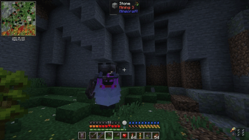
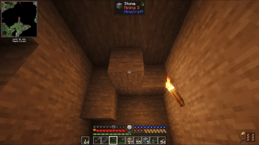
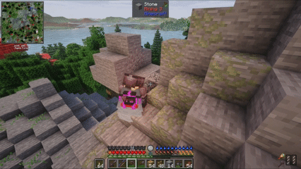
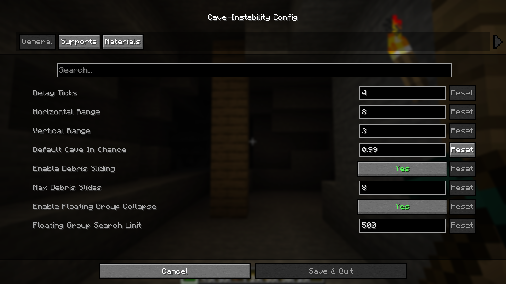
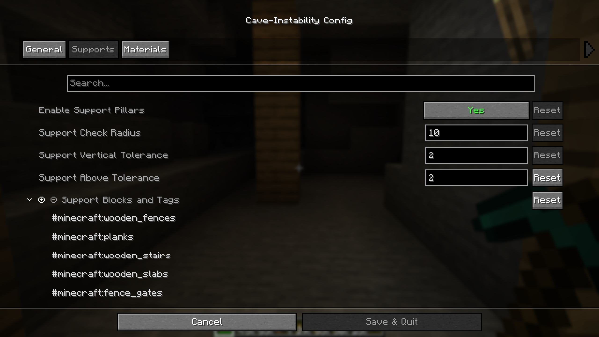

# Cave-Instability

  

> **Dig carefully—every block you remove could bring the cave down around you.**

Cave-Instability makes underground mining more dangerous, dynamic, and believable by allowing unsupported cave materials to collapse.

  

Blocks configured as unstable can fall when support is removed, triggering localized cave-ins that spread through nearby material. Falling debris produces impact sounds and dust particles, turning excavation into something that requires a little more thought than simply swinging a pickaxe.

## Features

### Cave-Ins

Removing support from unstable material can trigger a localized collapse. Cave-ins can propagate horizontally and vertically through nearby blocks, allowing anything from a few loose blocks to a substantial section of cave to come crashing down.

  

Collapse behavior is configurable, including the chance of individual blocks or entire block tags becoming unstable.

### Debris Sliding and Avalanches

Falling material doesn't always stop where it lands. Debris can slide downhill and continue falling until it reaches stable ground, producing more natural-looking piles instead of perfectly vertical stacks.

  

Debris sliding can be enabled or disabled, and the maximum number of slides is configurable.

### Floating Group Collapse

Unsupported rock formations don't have to remain magically suspended in the air.

Cave-Instability can detect connected groups of unstable blocks that have become completely detached from the surrounding terrain and collapse the entire formation.

  

A configurable search limit prevents excessively large floating formations from causing expensive searches.

### Support Pillars

Mining doesn't have to be reckless. Players can reinforce caves with functional support pillars constructed from configurable materials.

  

A valid support must connect the cave floor to the ceiling. Properly constructed supports stabilize nearby material and can prevent cave-ins from starting within their effective radius.

Support materials and detection distances are fully configurable, allowing support systems to work with both vanilla and modded blocks.

## Configuration

Cave-Instability includes full **Mod Menu** and **Cloth Config** integration.

Players can configure:

* Cave-in probability
* Horizontal and vertical collapse range
* Cave-in delay
* Debris sliding
* Maximum debris slides
* Floating-group collapse
* Floating-group search limit
* Support pillars
* Support radius and detection tolerances
* Valid support materials
* Collapsible blocks and block tags
* Individual collapse probabilities for configured materials

Block IDs and tags can be used throughout the configuration, making Cave-Instability compatible with materials added by other mods.

  

  

  

## Designed for Different Playstyles

Cave-Instability is designed to make caves feel less static while remaining highly configurable.

Keep the settings subtle for occasional cave-ins, increase the instability for dangerous underground exploration, or build reinforced mines where careful excavation and properly constructed supports become part of survival.

## Compatibility

**Minecraft:** 1.21.1  
**Mod Loader:** Fabric

Designed to support both vanilla and modded blocks through Minecraft block IDs and tags.

## Requirements

* Fabric API
* Mod Menu
* Cloth Config API

## License

**All Rights Reserved.**

Cave-Instability and its source code are publicly available for viewing and reference purposes only.

You may use the mod for personal use and include it in modpacks. Redistribution, rehosting, modification, or publication of modified or ported versions of the mod is not permitted without explicit permission from the author.

© 2026 Itinerant Mods

## Support

If you enjoy my mods and would like to support future development, you can find **Itinerant Mods** on Ko-fi.

## Author

Created by **Itinerant Mods**.

[Ko-fi](https://ko-fi.com/itinerantmods) • [YouTube](https://youtube.com/@itinerantmods)
