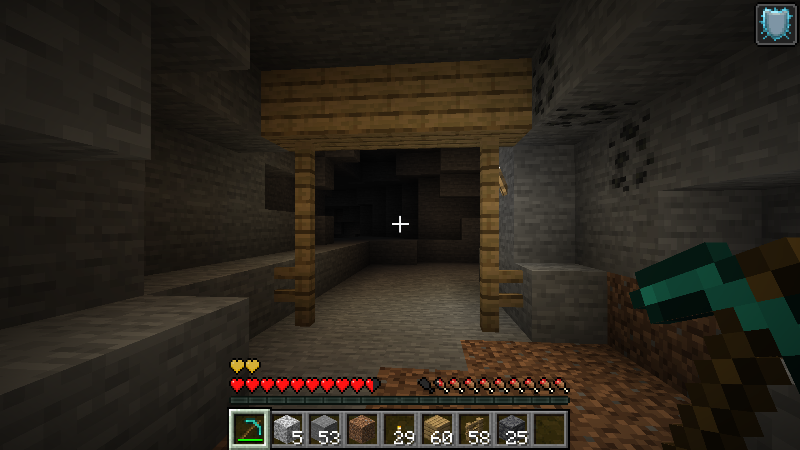
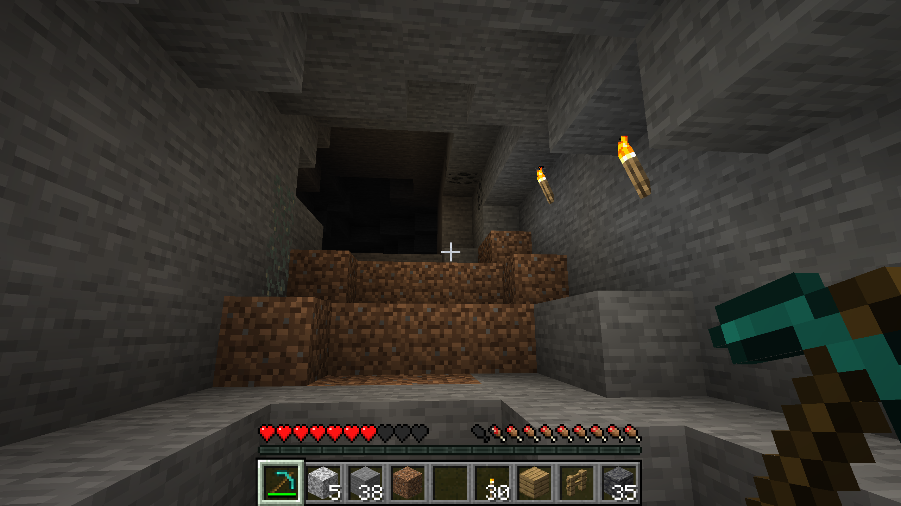
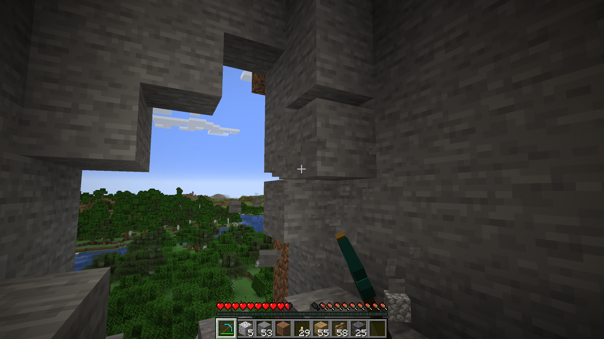
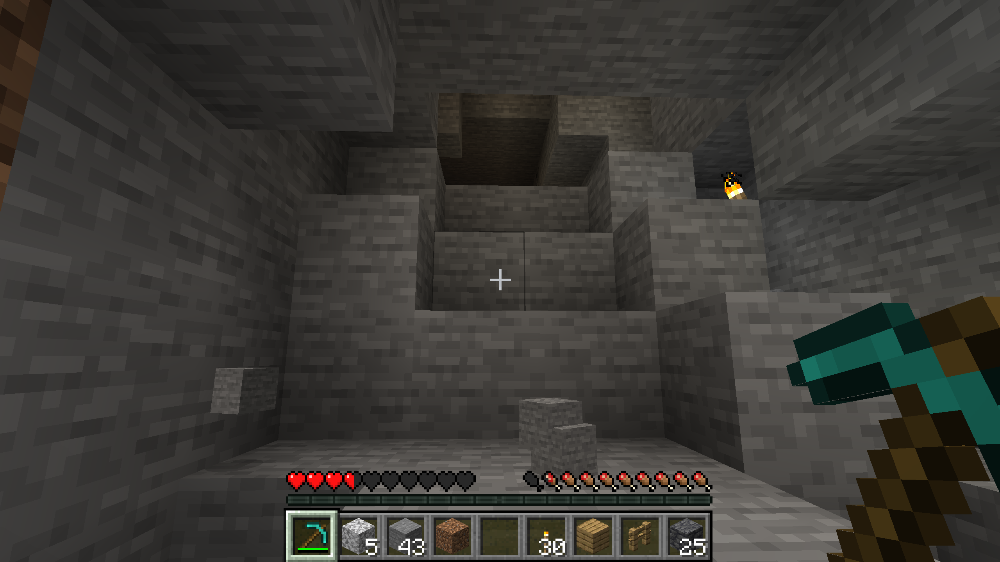
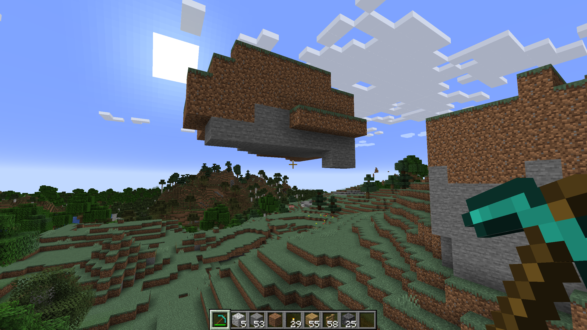
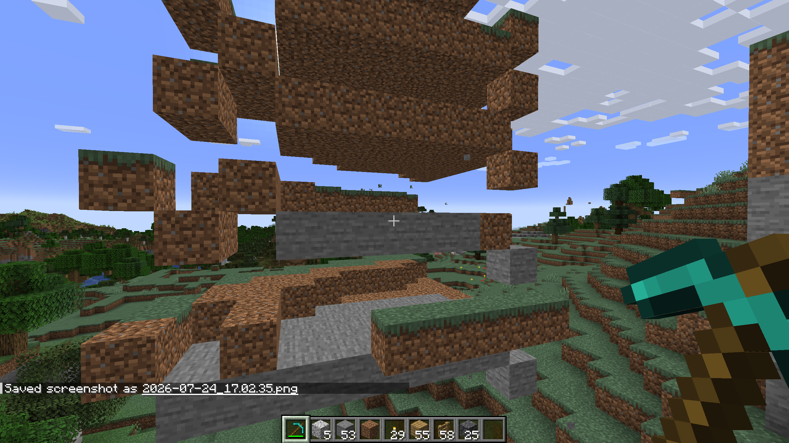
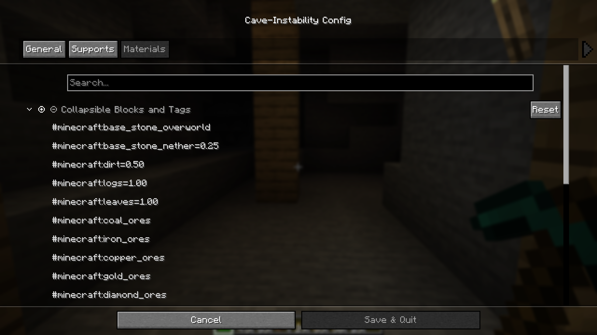

# Cave-Instability

  

> **Dig carefully—every block you remove could bring the cave down around you.**

Cave-Instability makes underground mining more dangerous, dynamic, and believable by transforming Minecraft's perfectly stable caves into living geological environments.

Unsupported cave materials can collapse when support is removed, triggering localized cave-ins that spread through nearby rock. Falling debris produces impact sounds, throws up dust particles, and can slide downhill after landing to create natural-looking rubble piles instead of perfectly vertical stacks.

The mod also introduces large-scale structural behavior. Entire connected groups of unstable blocks can collapse when left suspended in midair, eliminating unrealistic floating stone formations. To protect valuable tunnels and mining operations, players can construct support pillars from configurable materials. A valid pillar extends from solid ground to the cave ceiling, reinforcing nearby rock and preventing cave-ins before they begin.

Whether you want subtle environmental hazards or brutally unforgiving underground expeditions, Cave-Instability is fully configurable to fit your play style.

---

# Functional Support Pillars

Support pillars provide structural reinforcement to nearby cave ceilings. Build them from any configured support material to stabilize dangerous excavations and prevent nearby cave-ins.

> **TODO:** Replace this screenshot with a looping GIF showing a collapse prevented by a completed support pillar.

  

---

# Progressive Cave Collapses

Mining a single supporting block can trigger a localized cave-in that spreads naturally through weakened rock. Every excavation becomes a calculated risk.

> **TODO:** Replace with a GIF showing the collapse sequence.

  

  

  

---

# Natural Debris Piles

Collapsed material doesn't simply fall straight down. Debris can slide downhill after impact, creating rubble piles that look naturally formed.

> **TODO:** Replace with a GIF highlighting debris sliding.

  

---

# Floating Formation Collapse

Unsupported floating terrain no longer remains suspended forever. Large connected formations can collapse once they lose all structural support.

> **TODO:** Replace these screenshots with a GIF.

  

  

---

# Extensive Configuration

Nearly every aspect of Cave-Instability can be customized through Mod Menu.

- Collapse probability
- Propagation limits
- Debris sliding
- Floating group detection
- Support pillar behavior
- Support materials
- Search radius
- Dust particles
- Sound effects

### General Settings

  

### Collapsible Materials

  

### Support Configuration

  

---

# Compatibility

- Minecraft **1.21.1**
- Fabric Loader
- Fabric API
- Mod Menu (recommended)

Compatible with both vanilla and modded blocks through configurable block IDs and block tags.

---

# License

Released under the MIT License.

---

  

**Part of the Itinerant Mods Collection**

Creating immersive, configurable, and performance-conscious Minecraft mods for Fabric.

